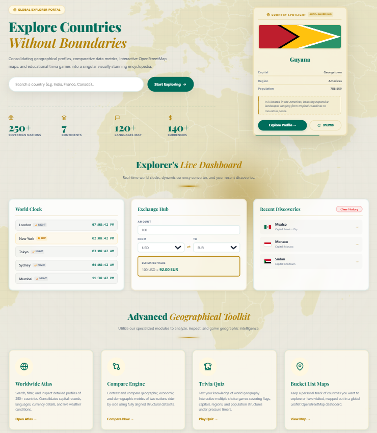
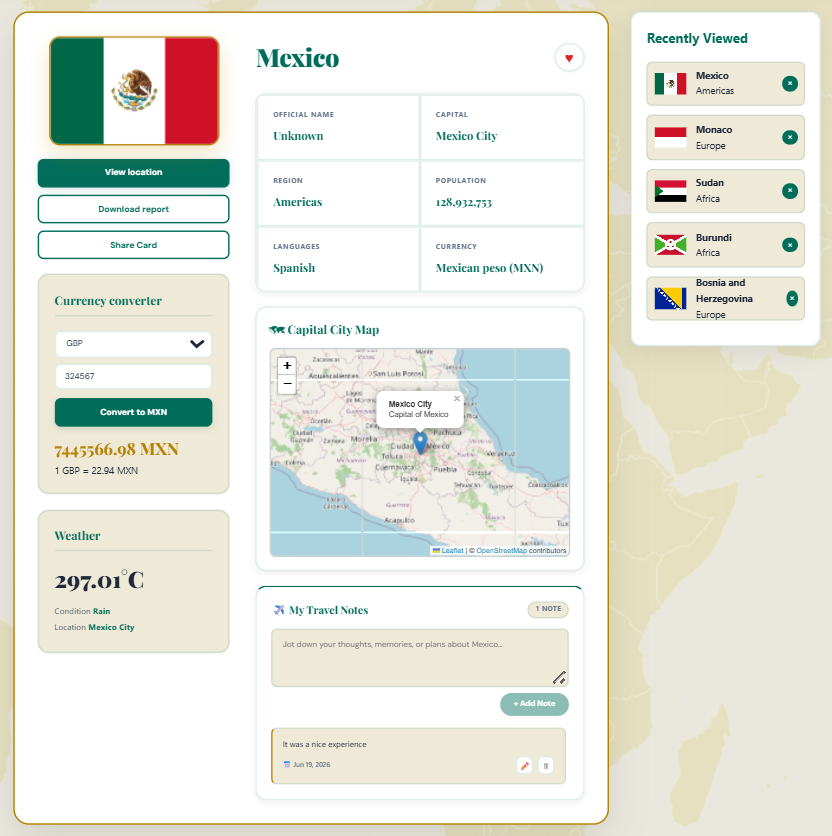
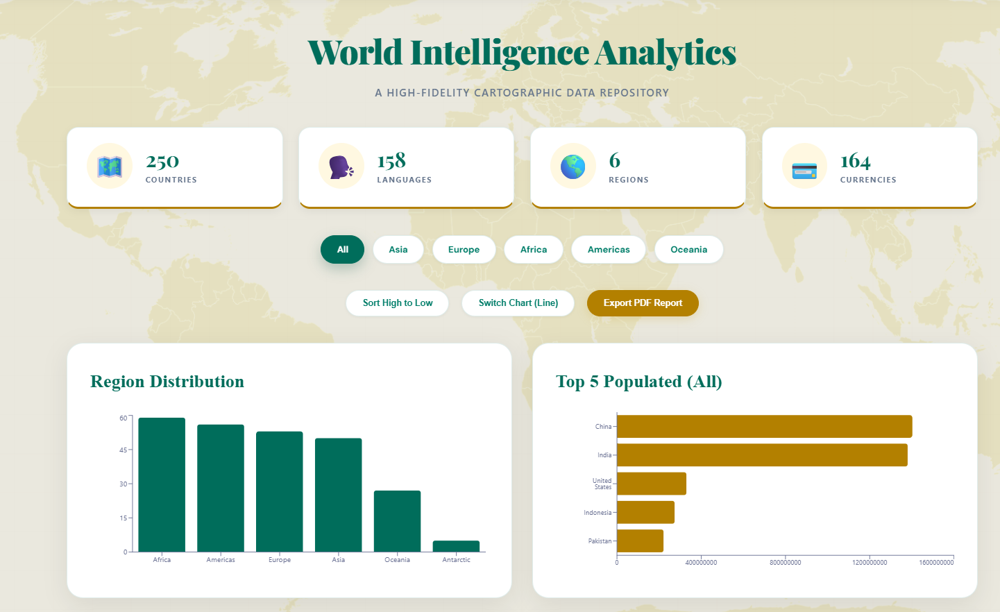
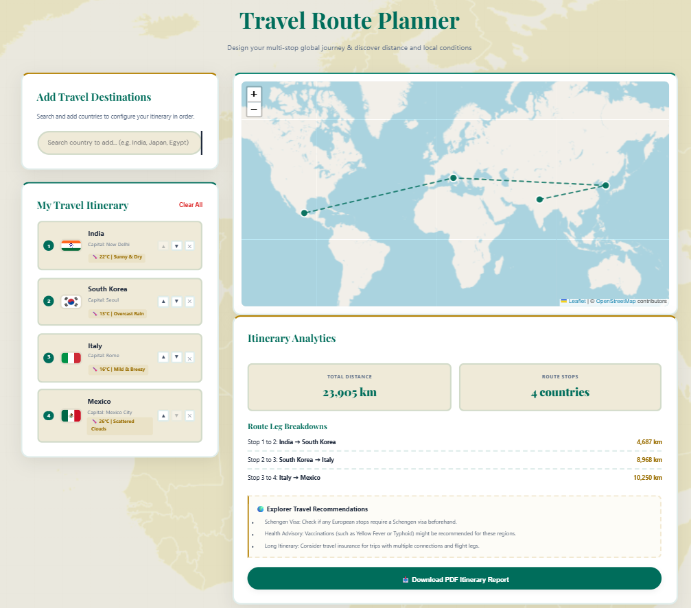
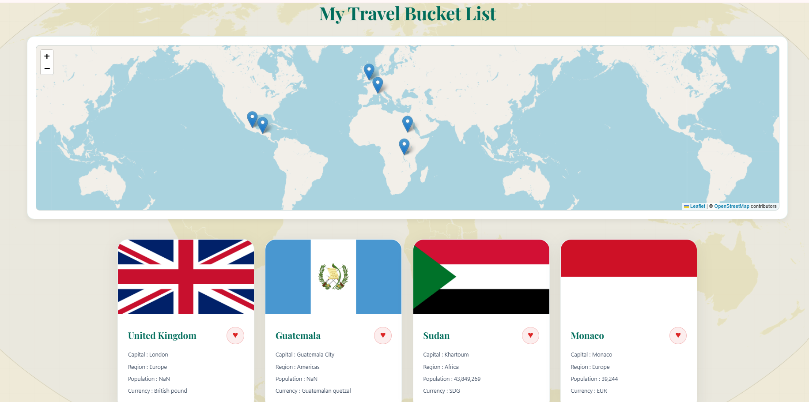
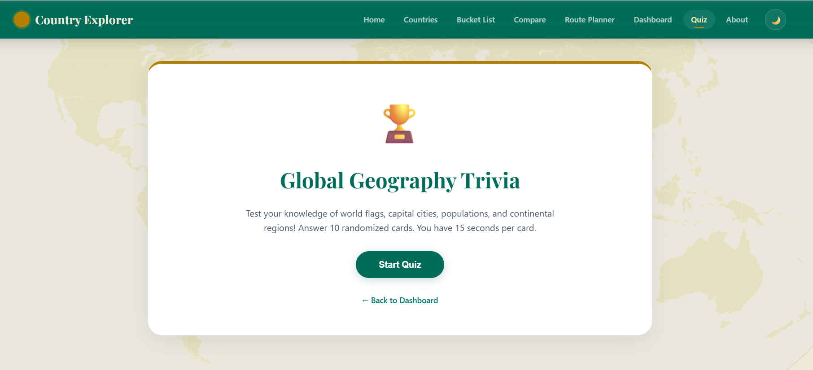
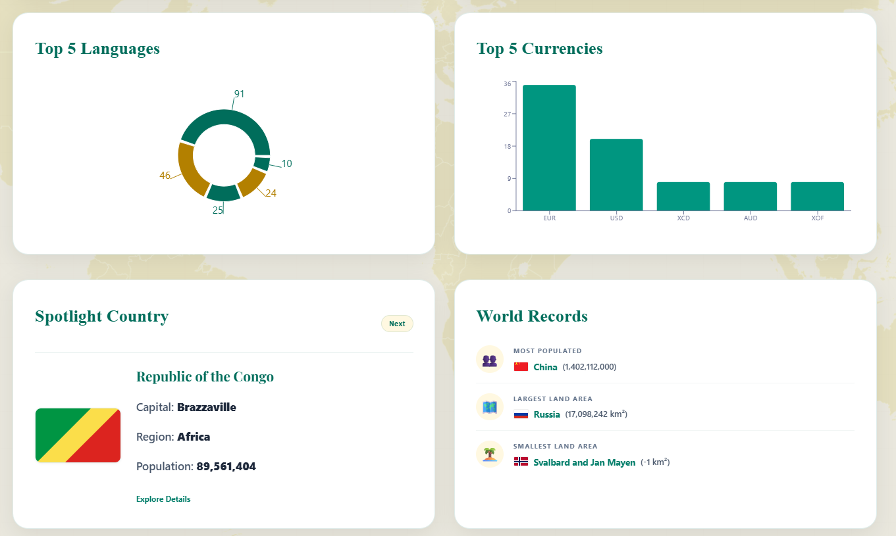
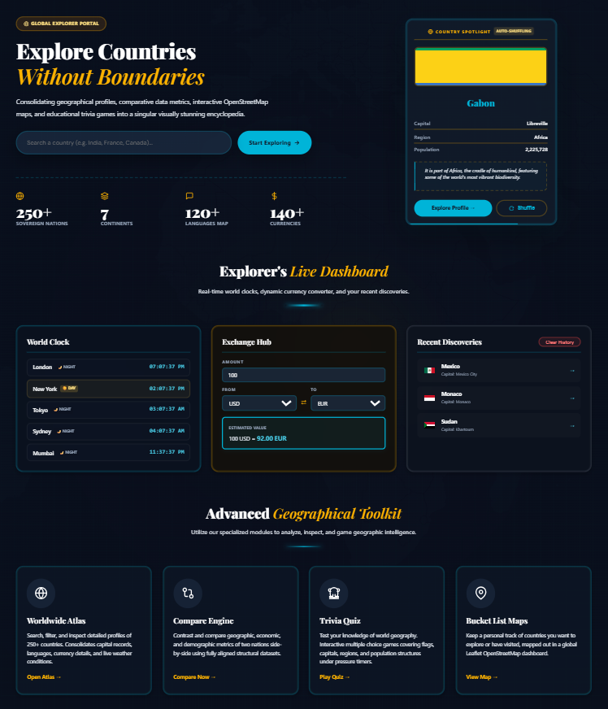

# 🌍 Country Explorer

Country Explorer is a modern React-based geographical intelligence web application that allows users to explore countries around the world through interactive data visualization, maps, comparison tools, travel planning, quizzes, and analytics.

The platform combines country information, live data APIs, interactive maps, and dashboard insights to provide an engaging way to learn about global geography.

---

## 📸 Project Preview

### Home Page


### Explorer Dashboard Features


### Country Search & Filtering


### Country Details


### Analytics Dashboard


### Country Comparison


### Travel Route Planner


### Bucket List Map


### Geography Quiz


### Currency Converter


### World Statistics Dashboard


### Dark Mode



---

# ✨ Features

## 🌎 Country Explorer
- Explore 250+ countries worldwide
- Search countries by:
  - Country name
  - Capital city
  - Region
  - Currency
  - Language
- View detailed country information:
  - Flag
  - Capital
  - Population
  - Region
  - Languages
  - Currency information


---

## 📊 World Intelligence Dashboard

Interactive analytics dashboard displaying:

- Total countries
- Regions
- Languages
- Currency statistics
- Population insights
- Regional distribution charts
- Top populated countries


---

## 🔍 Country Comparison System

Compare two countries side-by-side based on:

- Population
- Capital
- Region
- Currency
- Languages
- Weather conditions

Provides a simple visual comparison experience.


---

## 🗺️ Interactive Maps

Integrated map features using OpenStreetMap:

- Country location visualization
- Travel bucket list mapping
- Multi-country route visualization


---

## ✈️ Travel Route Planner

Create your global travel journey:

Features:
- Add multiple countries
- Generate route paths
- Display route distance
- View travel stops
- Interactive map markers


---

## ⭐ Travel Bucket List

Users can:

- Save favorite countries
- View saved countries on world map
- Remove countries
- Track visited destinations


---

## 🧠 Geography Quiz

Interactive learning module:

- Random country questions
- Flags quiz
- Capitals quiz
- Region based questions
- Timer based challenge


---

## 📈 World Statistics

Provides global insights:

- Top languages
- Top currencies
- Largest population records
- Largest land area records
- Country spotlight information


---

## 💱 Currency Converter

Currency exchange interface allowing users to:

- Select currencies
- Enter amount
- View converted values


---

## 🌙 Dark Mode

Includes dark theme support for:

- Better accessibility
- Improved user experience
- Modern UI appearance


---

# 🛠️ Technologies Used

## Frontend

- React.js
- JavaScript
- HTML5
- CSS3

## Libraries

- React Router
- Axios
- Recharts
- Leaflet Map
- React Leaflet


## APIs Used

- REST Countries API
- OpenWeatherMap API
- Currency API
- OpenStreetMap


---

# 📂 Project Structure


```text
Country-Explorer

├── public
│
├── src
│   |
│   ├── components
│   │   ├── Header.js
│   │   ├── Footer.js
│   │   ├── CountryCard.js
│   │   ├── Loader.js
│   │   └── RecentlyViewed.js
│   |
│   ├── pages
│   │   ├── Home.js
│   │   ├── Countries.js
│   │   ├── CountryDetails.js
│   │   ├── Compare.js
│   │   ├── BucketList.js
│   │   ├── Dashboard.js
│   │   ├── Quiz.js
│   │   └── About.js
│   |
│   ├── App.js
│   ├── index.js
│   └── App.css
│
├── screenshots
├── package.json
└── README.md
```

---

# ⚙️ Installation and Setup

Clone the repository

```bash
git clone https://github.com/your-username/Country-Explorer.git
```

Move into project folder

```bash
cd Country-Explorer
```

Install dependencies

```bash
npm install
```

Create environment file:

```text
.env
```

Add your API keys:

```env
REACT_APP_WEATHER_API_KEY=your_api_key
```

Start development server

```bash
npm start
```

Application runs at:

```text
http://localhost:3000
```


---

# 🔐 Environment Security

API keys are stored using environment variables.

The `.env` file is ignored using `.gitignore` and is not uploaded to GitHub.


---

# 📌 Future Enhancements

- AI travel recommendation system
- User authentication
- Personalized travel profiles
- More advanced analytics
- Offline country encyclopedia


---

# 👩‍💻 Developer

**Manisha G**

Artificial Intelligence & Data Science Student

---

# ⭐ Support

If you like this project, consider giving the repository a star ⭐
